# Zeus Platform — Architecture

> Modular, multi-tenant SaaS platform. A shared **Platform Core** provides identity, tenancy, billing and entitlements. Each capability is an **independently sellable service**. Runs on managed free tiers; the only variable cost is LLM usage.

## Stack (locked decisions)

| Concern | Choice | Notes |
| --- | --- | --- |
| Frontend | React (Vite) SPA + SSG marketing | Hosted on Vercel (free) |
| BFF / Gateway | Python **FastAPI** | Single-language backend, Vercel Functions |
| Services | Python **FastAPI** | One per module, schema-per-service |
| Auth | **Supabase Auth** now → Keycloak-ready adapter | Open-source, no lock-in |
| Database | **Supabase Postgres** + RLS | Schema-per-service isolation |
| Cache | **Redis** (Upstash) | Sessions, entitlements, prompt cache |
| Queue / eventing | **QStash** (HTTP MQ) behind `Queue` adapter | RabbitMQ swappable later |
| Storage | Supabase Storage | Evidence, documents |
| Billing | **Stripe** | Per-module subscriptions |
| Observability | **Grafana Cloud** (free) | Logs, metrics, traces via OTel |
| AI | Pluggable `LlmProvider` | OpenAI / Anthropic / Gemini |

Every external dependency sits behind an **adapter interface** (`AuthProvider`, `LlmProvider`, `Queue`, `Cache`, `Storage`, `BillingProvider`) so nothing is a hard lock-in.

---

## 1. High-Level Design (HLD)

### 1.1 System context

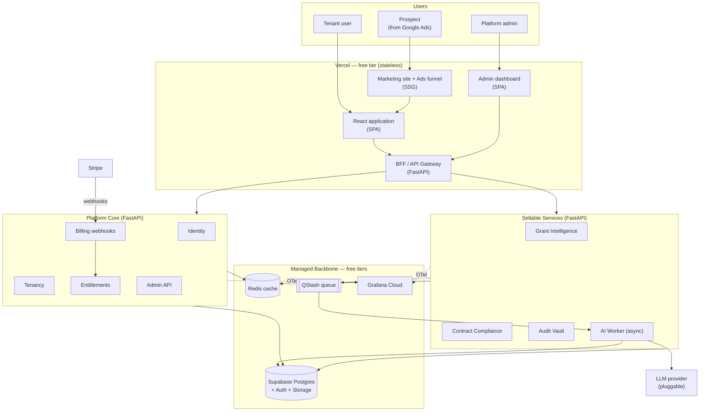

### 1.2 Logical layers

```mermaid
flowchart LR
    subgraph L1["Experience"]
        direction TB
        A1["Marketing / SEO"]
        A2["Tenant app"]
        A3["Admin console"]
    end
    subgraph L2["Edge / BFF"]
        direction TB
        B1["AuthN"]
        B2["Tenant resolve"]
        B3["Entitlement guard"]
        B4["Routing + aggregation"]
    end
    subgraph L3["Domain services"]
        direction TB
        C1["Grant Intelligence"]
        C2["Contract Compliance"]
        C3["Audit Vault"]
    end
    subgraph L4["Async"]
        direction TB
        D1["Queue"]
        D2["AI Worker"]
    end
    subgraph L5["Platform core"]
        direction TB
        E1["Identity"]
        E2["Tenancy"]
        E3["Entitlements"]
        E4["Billing"]
        E5["Prompt + config registry"]
    end
    subgraph L6["Data + infra"]
        direction TB
        F1[("Postgres + RLS")]
        F2[("Redis")]
        F3["Object storage"]
        F4["Observability"]
    end

    L1 --> L2 --> L3 --> L4
    L2 --> L5
    L3 --> L5
    L3 --> L6
    L4 --> L6
    L5 --> L6
```

### 1.3 Entitlement-driven access (the core selling mechanic)

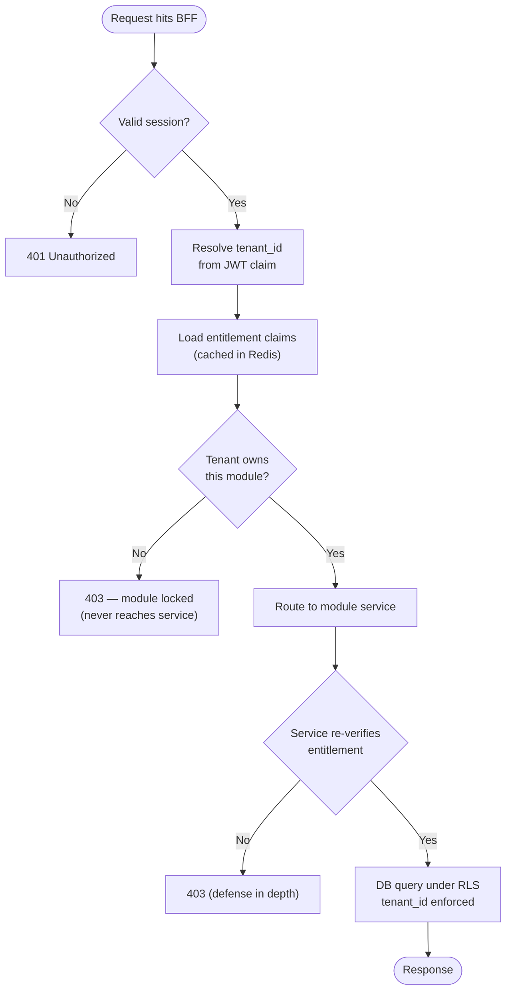

---

## 2. Low-Level Design (LLD)

### 2.1 Repository / deployment topology

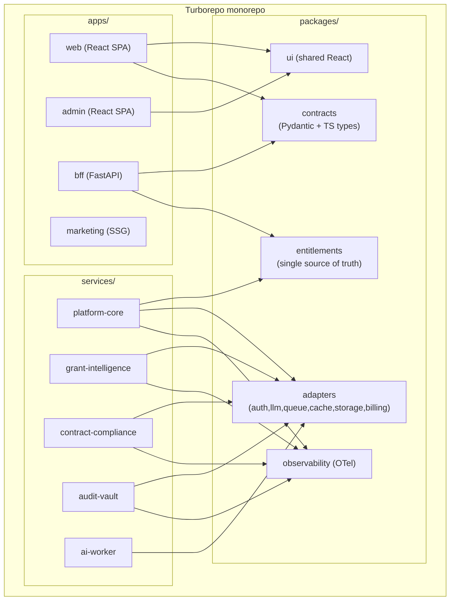

### 2.2 Adapter interfaces (removes vendor lock-in)

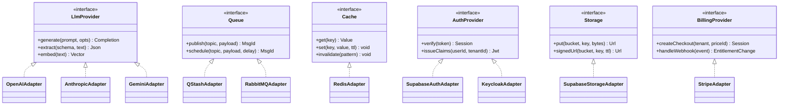

### 2.3 Multi-tenant data model (platform core)

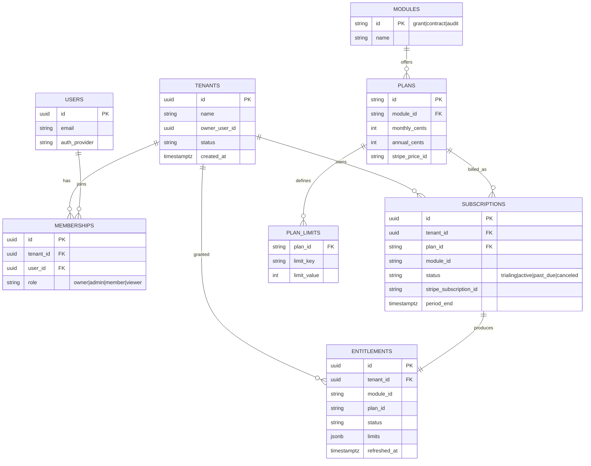

### 2.4 Checkout → provisioning sequence

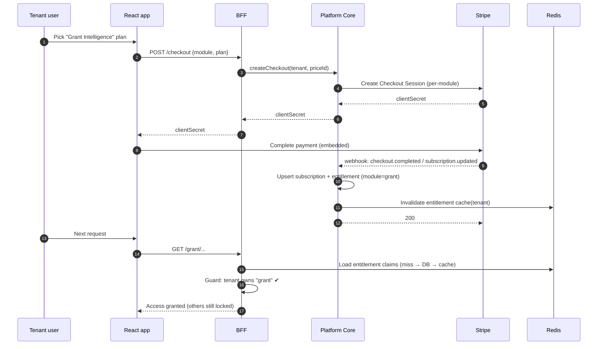

### 2.5 Async AI job (queue + worker)

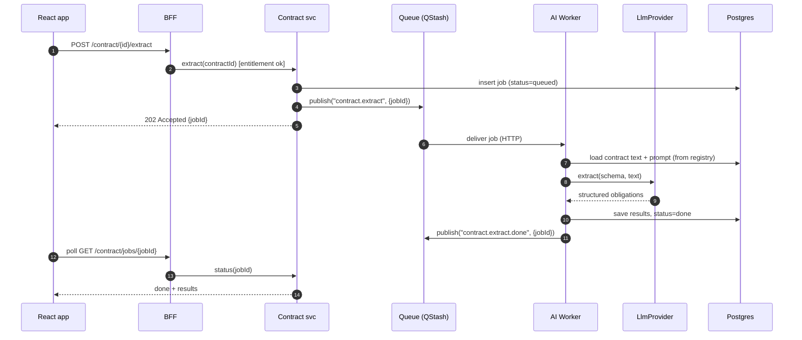

### 2.6 Admin control plane (live config, no redeploy)

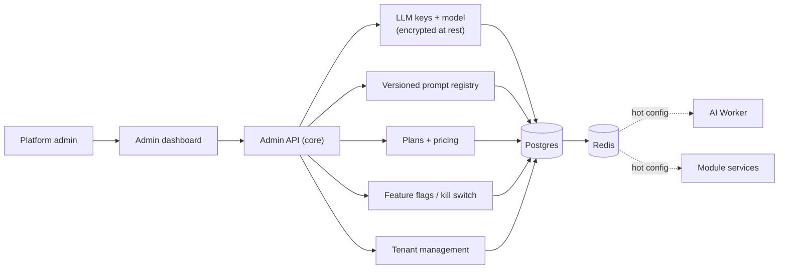

---

## 3. Cross-cutting concerns

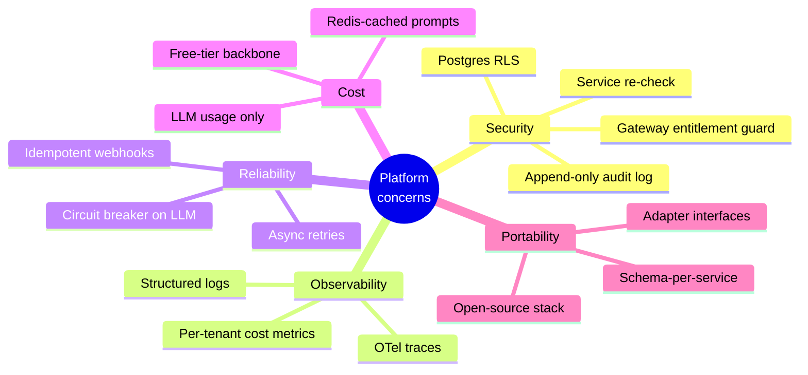

---

## 4. Migration path (strangler pattern)

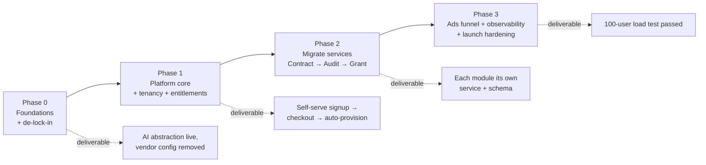

**Order of service extraction:** Contract Compliance first (cleanest boundaries, `compliance_*` tables already isolated), then Audit Vault, then Grant Intelligence.
