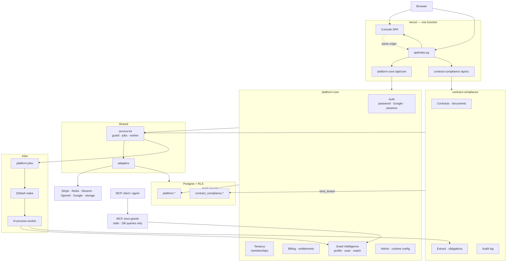
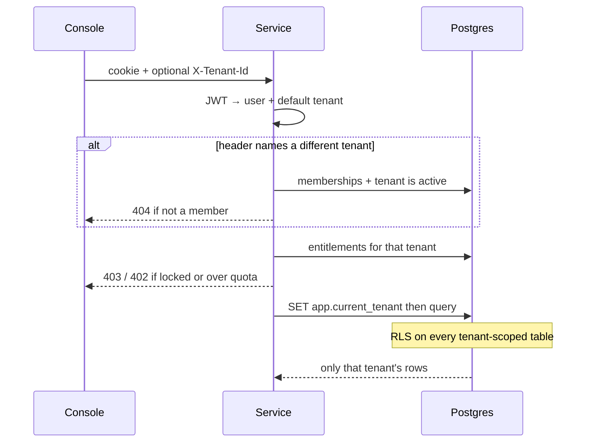

# Platform architecture

What is actually running under `platform/`. Root `src/` is the old Lovable app and is not part of this.

One Vercel function serves the console and both APIs. Two FastAPI services, one Postgres, one job ledger.

## Request path

Every authenticated call goes through the same four checks.

## What sits where

| Piece | Role |
|---|---|
| Console | `apps/console` — login, billing, grants, contracts |
| Entrypoint | `api/index.py` — mounts both APIs and serves the SPA |
| platform-core | identity, tenancy, billing, Grant Intelligence, admin |
| contract-compliance | contracts, documents, extraction, obligations |
| MCP `zeus-grants` | stdio tools over the same grant data; no model in the tool path |
| service-kit | membership check, module guard, job ledger, worker |
| adapters | db, cache, queue, llm, billing, email, storage, auth — swapped by env |

Auth is first-party: email/password and Google OAuth, sessions as JWTs. Not Supabase Auth.

## Jobs

Slow work (grant scan, contract extraction) is a row in `platform.jobs`. Enqueue publishes a QStash wake. The same serverless function drains the ledger for its own module. A failed publish does not lose the row.

## Data

Two schemas. Tenant-scoped tables have RLS enabled and forced.

- `platform.*` — users, sessions, tenants, memberships, subscriptions, entitlements, jobs, org_profiles, opportunities, matches
- `contract_compliance.*` — contracts, documents, obligations, audit_log

Shared catalogue and config tables have no `tenant_id` and no RLS.

## Local vs production

Same paths in both. Vite proxies `/api/core` and `/api/cc` locally; production mounts them in one function. MCP is a separate stdio process, not part of the HTTP function.
